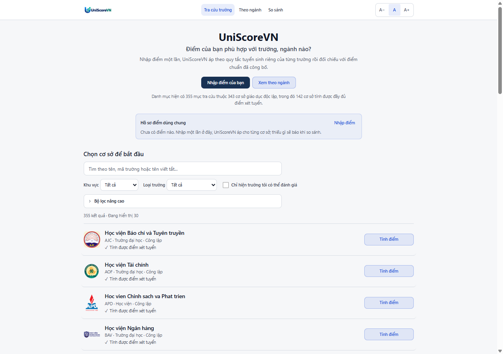

<p align="center">
  <picture>
    <source media="(prefers-color-scheme: dark)" srcset="public/brand/wordmark-white.png" />
    <source media="(prefers-color-scheme: light)" srcset="public/brand/wordmark-color.png" />
    
  </picture>
</p>

<p align="center">
  Công cụ tính &amp; so sánh điểm xét tuyển đại học Việt Nam — nhập điểm một lần, đối chiếu với quy tắc tuyển sinh riêng của từng trường.
</p>

<p align="center">
  <a href="https://uniscorevn.vercel.app"><b>uniscorevn.vercel.app</b></a> ·
  <a href="https://github.com/shadowhunter67/uniscorevn/issues">Báo lỗi &amp; góp ý</a> ·
  <a href="LICENSE">AGPL-3.0</a>
</p>

<p align="center">
  
</p>

> ⚠️ UniScoreVN là công cụ độc lập, không thuộc Bộ GD&ĐT hay bất kỳ cơ sở đào tạo nào. Kết quả chỉ mang tính tham khảo; người dùng phải đối chiếu đề án và thông báo tuyển sinh chính thức.

## Giới thiệu

UniScoreVN là công cụ tính, so sánh và mô phỏng điểm xét tuyển tại các trường đại học, học viện và cao đẳng Việt Nam — chạy hoàn toàn trên trình duyệt, không backend, không cần đăng nhập.

Mỗi công thức được triển khai theo quy định tuyển sinh của từng cơ sở đào tạo và gắn nguồn chính thức. Trường hoặc phương thức chưa đủ dữ liệu sẽ được đánh dấu chưa hỗ trợ thay vì ước đoán.

Repo public này theo mô hình open-core: UI, generic engine, compare framework, public tests, methodology, và runtime artifacts cần để app chạy vẫn công khai. Source-of-truth research, normalized dataset, source conflict notes, deep audit, và export pipeline được duy trì trong private UniScoreVN data pipeline.

## Tính năng

- Tính điểm xét tuyển realtime từ điểm ĐGNL, THPT, học bạ (cả năm lẫn theo 6 học kỳ), điểm cộng, điểm ưu tiên
- Hồ sơ điểm dùng chung theo progressive disclosure — chỉ hiện ô nhập cho loại điểm bạn thực sự có, không phải khai báo toàn bộ cấu trúc dữ liệu cùng lúc
- So sánh cùng một hồ sơ trên nhiều nguyện vọng qua [`/compare`](https://uniscorevn.vercel.app/compare), đọc theo bảng ngang thay vì lật từng thẻ
- Gợi ý trường/ngành phù hợp theo [`/nganh`](https://uniscorevn.vercel.app/nganh): Thử sức / Vừa sức / An toàn hơn
- Quy đổi chứng chỉ quốc tế (IELTS/TOEFL/TOEIC/DELF/TCF/JLPT/HSK...) sang điểm thi THPT
- Đặt mục tiêu điểm số, tính ngược ĐGNL cần đạt; mô phỏng kịch bản điểm giả định
- So sánh với điểm chuẩn tham khảo nhiều ngành, nhiều năm — có audit trail từng bước tính, không chỉ đưa ra một con số
- Nhập điểm một lần, dùng lại cho nhiều trường; chia sẻ kết quả qua URL, không cần tài khoản
- Tự lưu điểm đã nhập trên trình duyệt (không gửi lên server)

## Phạm vi và độ phủ

UniScoreVN xây dựng danh mục các cơ sở tuyển sinh đại học và cao đẳng tại Việt Nam. Calculator chỉ được kích hoạt đối với phương thức có đủ nguồn tuyển sinh chính thức. Cao đẳng thuộc giáo dục nghề nghiệp được phân loại riêng với nhóm đại học và cao đẳng ngành Giáo dục Mầm non; trung cấp không nằm trong scope iteration này.

Roadmap calculator xác minh đang tiến từ mốc 100 (2026-09-02) hướng tới 150. Lịch sử đầy đủ từng batch (mở rộng calculator lẫn mở rộng danh mục) nằm ở [docs/school-status.md](docs/school-status.md) và [docs/catalog-expansion-report.md](docs/catalog-expansion-report.md) — không lặp lại trong README để tránh lệch dữ liệu.


Snapshot hiện tại được tính từ `schoolRegistry` bằng `npm run stats:coverage` (ảnh trên sinh từ cùng nguồn số liệu bằng `npm run coverage:chart` — chạy lại sau mỗi lần coverage đổi để ảnh khớp số thật):

<!-- coverage:kpi:start (generated bởi `npm run stats:coverage -- --write`, xem scripts/stats-coverage.ts — KHÔNG sửa tay) -->
| KPI | Số lượng |
|---|---:|
| Mục trong danh mục/search/compare | 355 |
| Cơ sở giáo dục độc lập trong danh mục | 343 |
| Đơn vị nội bộ/không tính vào KPI cơ sở | 12 |
| Đại học / cơ sở hệ đại học | 235 |
| Học viện | 22 |
| Cao đẳng sư phạm/GDMN | 9 |
| Cao đẳng giáo dục nghề nghiệp | 77 |
| Nhóm độc lập khác | 0 |
| Có dữ liệu tuyển sinh hoặc capability cao hơn | 248 |
| Chỉ kiểm tra điều kiện/ngưỡng | 5 |
| Có calculator một phần | 1 |
| Calculator đã xác minh | 179 |
| Chỉ có trong danh mục | 107 |
<!-- coverage:kpi:end -->

Catalog coverage != calculator coverage. Con số danh mục là độ phủ search/compare, không phải 100% calculator. Một số mục trong danh mục là school/faculty nội bộ của hệ thống đại học lớn; các mục này vẫn có thể giữ cho navigation hoặc mapping chương trình, nhưng không làm tăng KPI "cơ sở đào tạo tuyển sinh độc lập".

Nguồn nhóm đại học 238 ban đầu là số liệu tổng hợp thứ cấp tính đến 09/2025 ([nguồn](https://veci.edu.vn/nam-2025-ca-nuoc-co-238-co-so-giao-duc-dai-hoc-gan-1-200-co-so-giao-duc-nghe-nghiep/)). Nhóm cao đẳng (GDNN + sư phạm) hiện có nguồn chính thức theo từng lát dữ liệu: Cổng tuyển sinh Bộ GD&ĐT về phạm vi tuyển sinh đại học/CĐ ngành Giáo dục Mầm non, Quyết định 1723/QĐ-TTg trên cổng Chính phủ về các trường cao đẳng công lập trực thuộc Bộ GD&ĐT, danh sách cơ sở GDNN theo từng địa phương, và danh sách cơ sở giáo dục đại học/cao đẳng sư phạm được kiểm định của Cục Quản lý chất lượng - Bộ GD&ĐT (VQA). UniScoreVN chưa claim đã phủ toàn bộ hệ thống cao đẳng giáo dục nghề nghiệp — chi tiết nguồn và giới hạn từng đợt mở rộng xem [docs/catalog-expansion-report.md](docs/catalog-expansion-report.md).

## Trạng thái hỗ trợ

Mức hỗ trợ đổi thường xuyên (mỗi batch nghiên cứu mới lại nâng hạng một số trường) nên README không liệt kê tên từng trường — xem danh sách chi tiết tại [docs/school-status.md](docs/school-status.md), phương pháp/nguồn tại [docs/data-methodology.md](docs/data-methodology.md), hoặc chạy `npm run stats:coverage` để xem số liệu mới nhất (bảng dưới đây phải khớp con số lệnh đó in ra — nếu lệch, README đang bị drift và cần chạy lại `npm run stats:coverage -- --write`, không sửa tay từng con số).

<!-- coverage:support-status:start (generated bởi `npm run stats:coverage -- --write`, xem scripts/stats-coverage.ts — KHÔNG sửa tay) -->
| Mức hỗ trợ | Số trường | Ý nghĩa |
|---|---:|---|
| ✅ Tính được điểm xét tuyển | 179 | Công thức, ngưỡng, điểm cộng và điểm ưu tiên đều có nguồn chính thức trong phạm vi đã công bố. |
| 🟡 Tính được một phần | 1 | Có công thức thật nhưng chưa phủ hết mọi phương thức xét tuyển của trường. |
| 🟡 Kiểm tra được điều kiện | 5 | Có ngưỡng điểm sàn/điều kiện chính thức, chưa tính được điểm xét tuyển đầy đủ. |
| ⚪ Đã có thông tin tuyển sinh | 63 | Đã có thông tin tuyển sinh chính thức, nhưng chưa đủ để tính điểm hay kết luận điều kiện. |
| ⚪ Chưa có dữ liệu tuyển sinh | 107 | Trường có trong danh mục nhưng UniScoreVN chưa tìm được nguồn tuyển sinh chính thức nào. |
<!-- coverage:support-status:end -->

"Tính đầy đủ điểm xét tuyển" nghĩa là công thức, ngưỡng, điểm cộng và điểm ưu tiên đều có nguồn chính thức xác minh trong phạm vi đã công bố — một số trường chỉ chính xác trong phạm vi cụ thể (ví dụ thí sinh không có thành tích cộng điểm). Đây là mức độ đủ dữ liệu để áp dụng công thức, **không phải** xác suất trúng tuyển — UniScoreVN không đoán công thức khi nguồn chưa đủ rõ ràng.

## Bắt đầu

```bash
npm install
npm run dev             # dev server
npm run test            # chạy test
npm run lint             # lint
npm run build            # build production
npm run audit:data       # kiểm tra tính nhất quán/nguồn dữ liệu tuyển sinh
npm run stats:coverage   # in snapshot catalog/KPI/calculator
npm run coverage:chart   # sinh lại docs/coverage-chart.svg (biểu đồ nhúng trong README)
npm run check:bundle-size # kiểm tra budget bundle initial (không tự chạy khi push)
```

Trên Windows có thể double-click [start-dev.bat](start-dev.bat) — tự cài dependency nếu thiếu rồi mở dev server.

## Kiến trúc

Mỗi trường có công thức, thang điểm, và điều kiện xét tuyển riêng, sống độc lập trong `src/schools/<id>/` hoặc được nạp qua runtime artifacts trong `src/generated/` — không có "công thức chung" ép buộc. `src/core/` chỉ chứa phần thật sự dùng chung: hồ sơ điểm gốc của thí sinh, kiểu dữ liệu, và tiện ích tính toán. Public build không cần access private repo nếu generated artifacts đã được commit.

Chi tiết kiến trúc public nằm ở [docs/architecture-public.md](docs/architecture-public.md).

## Deploy

Deploy qua Vercel (framework preset: Vite), domain canonical `uniscorevn.vercel.app`.

## Tài liệu thêm

- [docs/architecture-public.md](docs/architecture-public.md) — kiến trúc public/open-core
- [docs/data-methodology.md](docs/data-methodology.md) — methodology dữ liệu public
- [docs/school-status.md](docs/school-status.md) — trạng thái hỗ trợ theo từng trường + lịch sử batch calculator
- [docs/catalog-expansion-report.md](docs/catalog-expansion-report.md) — lịch sử mở rộng danh mục theo từng batch
- [docs/contributing-data.md](docs/contributing-data.md) — cách báo lỗi/cập nhật nguồn
- [docs/release-checklist.md](docs/release-checklist.md) — quy trình release

## License và dữ liệu

Code public được cấp phép theo AGPL-3.0-only, xem [LICENSE](LICENSE).

Dữ liệu/source notice được tách riêng trong [DATA_NOTICE.md](DATA_NOTICE.md). UniScoreVN không claim sở hữu độc quyền với factual data từ nguồn chính thức; runtime data public là bản compiled/normalized độc lập để app hoạt động và cần được đối chiếu lại với thông báo tuyển sinh chính thức.
