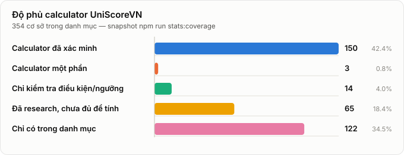

# UniScoreVN

Công cụ tính & so sánh điểm xét tuyển tại Việt Nam — nhập điểm một lần, xem kết quả ở nhiều cơ sở cùng lúc.

**[uniscorevn.vercel.app](https://uniscorevn.vercel.app)** · [GitHub](https://github.com/shadowhunter67/uniscorevn) · [Báo lỗi & góp ý](https://github.com/shadowhunter67/uniscorevn/issues)

> UniScoreVN là công cụ độc lập, không thuộc Bộ GD&ĐT hay bất kỳ cơ sở đào tạo nào. Kết quả chỉ mang tính tham khảo; người dùng phải đối chiếu đề án và thông báo tuyển sinh chính thức.

## Giới thiệu

UniScoreVN là công cụ tính, so sánh và mô phỏng điểm xét tuyển tại các trường đại học, học viện và cao đẳng Việt Nam — chạy hoàn toàn trên trình duyệt, không backend, không cần đăng nhập.

Mỗi công thức được triển khai theo quy định tuyển sinh của từng cơ sở đào tạo và gắn nguồn chính thức. Trường hoặc phương thức chưa đủ dữ liệu sẽ được đánh dấu chưa hỗ trợ thay vì ước đoán.

Repo public này theo mô hình open-core: UI, generic engine, compare framework, public tests, methodology, và runtime artifacts cần để app chạy vẫn công khai. Source-of-truth research, normalized dataset, source conflict notes, deep audit, và export pipeline được duy trì trong private UniScoreVN data pipeline.

## Tính năng

- Tính điểm xét tuyển realtime từ điểm ĐGNL, THPT, học bạ, điểm cộng, điểm ưu tiên
- So sánh cùng một hồ sơ trên nhiều trường qua [`/compare`](https://uniscorevn.vercel.app/compare)
- Quy đổi chứng chỉ ngoại ngữ quốc tế (IELTS/TOEFL/TOEIC...) sang điểm thi THPT
- Đặt mục tiêu điểm số, tính ngược ĐGNL cần đạt; mô phỏng kịch bản điểm giả định
- So sánh với điểm chuẩn tham khảo nhiều ngành, nhiều năm
- Nhập điểm một lần, dùng lại cho nhiều trường; chia sẻ kết quả qua URL, không cần tài khoản
- Tự lưu điểm đã nhập trên trình duyệt (không gửi lên server)

## Phạm vi và độ phủ

UniScoreVN xây dựng danh mục các cơ sở tuyển sinh đại học và cao đẳng tại Việt Nam. Calculator chỉ được kích hoạt đối với phương thức có đủ nguồn tuyển sinh chính thức. Cao đẳng thuộc giáo dục nghề nghiệp được phân loại riêng với nhóm đại học và cao đẳng ngành Giáo dục Mầm non; trung cấp không nằm trong scope iteration này.

🎉 **Cột mốc 100 calculator đã xác minh** (2026-09-02) — kết thúc chiến dịch mở rộng độ phủ bắt đầu từ 60 trường. Roadmap mới (100 -> 150) đã đạt 134 (2026-09-04) qua nhiều batch liên tiếp — xem lịch sử đầy đủ từng batch tại [docs/school-status.md](docs/school-status.md). Song song, batch **catalog-expansion** (2026-09-04) mở rộng độ phủ danh mục (KHÔNG phải calculator) thêm 6 cơ sở đại học/học viện công lập catalog-only còn thiếu (EPU, VUTM, HUPH, HMTU, NDUN, HUArt), **catalog-expansion batch 2** (2026-09-04/05) giải quyết 13 lead còn tồn đọng từ batch 1, thêm 10 cơ sở đại học/học viện mới (UNETI, VUI, SDU, QUI, VIU, MTU, BAFU, HVTA, TKS, DNTU) cùng 3 trường cao đẳng sư phạm còn độc lập (CĐSPKG, CĐSPTB, CĐSPBRVT), và **catalog-expansion batch 3** (2026-09-05) mở rộng tier cao đẳng GDNN (+14: 9 trường Đà Nẵng, 2 trường TP.HCM, 3 trường kế thừa sau sáp nhập CĐSP), tier cao đẳng sư phạm (+3, sau khi tải thành công danh sách kiểm định VQA từng bị chặn bởi file .rar) và 4 trường đại học tư thục nhỏ còn sót từ batch 1 (Intracom, Hà Hoa Tiên, Thành Đông, VXUT) — tổng +21 mục, đưa danh mục lên 307 mục danh mục (tương ứng 295 cơ sở giáo dục độc lập); **catalog-expansion batch 4** (2026-09-07) đối chiếu registry với danh sách mã trường thứ cấp (vietjack.com, chỉ dùng làm manh mối) và rà lại toàn bộ tier trường quân đội/công an, thêm +12 mục mới (IUV, MIT, THUV, HPU, DAU, SIU, TSQĐC, TGH, NH-SQLQ2, TDNU, NQU-SQCB, CDCT) — đưa danh mục lên 319 mục (tương ứng 307 cơ sở giáo dục độc lập) — xem [docs/catalog-expansion-report.md](docs/catalog-expansion-report.md).



Snapshot hiện tại được tính từ `schoolRegistry` bằng `npm run stats:coverage` (ảnh trên sinh từ cùng nguồn số liệu bằng `npm run coverage:chart` — chạy lại sau mỗi lần coverage đổi để ảnh khớp số thật):

<!-- coverage:kpi:start (generated bởi `npm run stats:coverage -- --write`, xem scripts/stats-coverage.ts — KHÔNG sửa tay) -->
| KPI | Số lượng |
|---|---:|
| Mục trong danh mục/search/compare | 355 |
| Cơ sở giáo dục độc lập trong danh mục | 343 |
| Đơn vị nội bộ/không tính vào KPI cơ sở | 12 |
| Đại học / cơ sở hệ đại học | 235 |
| Học viện | 22 |
| Cao đẳng sư phạm/GDMN | 9 |
| Cao đẳng giáo dục nghề nghiệp | 77 |
| Nhóm độc lập khác | 0 |
| Có dữ liệu tuyển sinh hoặc capability cao hơn | 226 |
| Chỉ kiểm tra điều kiện/ngưỡng | 22 |
| Có calculator một phần | 3 |
| Calculator đã xác minh | 134 |
| Chỉ có trong danh mục | 129 |
<!-- coverage:kpi:end -->

Catalog coverage != calculator coverage. Con số danh mục là độ phủ search/compare, không phải 100% calculator. Một số mục trong danh mục là school/faculty nội bộ của hệ thống đại học lớn; các mục này vẫn có thể giữ cho navigation hoặc mapping chương trình, nhưng không làm tăng KPI "cơ sở đào tạo tuyển sinh độc lập".

Nguồn nhóm đại học 238 ban đầu là số liệu tổng hợp thứ cấp tính đến 09/2025 ([nguồn](https://veci.edu.vn/nam-2025-ca-nuoc-co-238-co-so-giao-duc-dai-hoc-gan-1-200-co-so-giao-duc-nghe-nghiep/)). Nhóm cao đẳng (GDNN + sư phạm) hiện có 49 mục có nguồn chính thức theo từng lát dữ liệu: Cổng tuyển sinh Bộ GD&ĐT về phạm vi tuyển sinh đại học/CĐ ngành Giáo dục Mầm non 2026, Quyết định 1723/QĐ-TTg trên cổng Chính phủ về các trường cao đẳng công lập trực thuộc Bộ GD&ĐT (re-pull 2026-09-05, bản 12/8/2025), danh sách cơ sở GDNN Đà Nẵng đến 08/4/2025, hệ thống quản lý thông tin GDNN TP.HCM, và danh sách cơ sở giáo dục đại học/cao đẳng sư phạm được kiểm định của Cục Quản lý chất lượng - Bộ GD&ĐT (VQA, cập nhật 31/7/2026). UniScoreVN chưa claim đã phủ toàn bộ hệ thống cao đẳng giáo dục nghề nghiệp.

## Trạng thái hỗ trợ

Danh sách đầy đủ 319 trường theo từng mức hỗ trợ đổi thường xuyên (mỗi batch nghiên cứu mới lại nâng hạng một số trường) nên README không liệt kê tên — xem danh sách chi tiết theo trường tại [docs/school-status.md](docs/school-status.md), phương pháp/nguồn tại [docs/data-methodology.md](docs/data-methodology.md), hoặc chạy `npm run stats:coverage` để xem số liệu mới nhất (bảng dưới đây phải khớp con số lệnh đó in ra — nếu lệch, README đang bị drift và cần sửa thủ công lại).

<!-- coverage:support-status:start (generated bởi `npm run stats:coverage -- --write`, xem scripts/stats-coverage.ts — KHÔNG sửa tay) -->
| Mức hỗ trợ | Số trường | Ý nghĩa |
|---|---:|---|
| ✅ Tính được điểm xét tuyển | 134 | Công thức, ngưỡng, điểm cộng và điểm ưu tiên đều có nguồn chính thức trong phạm vi đã công bố. |
| 🟡 Tính được một phần | 3 | Có công thức thật nhưng chưa phủ hết mọi phương thức xét tuyển của trường. |
| 🟡 Kiểm tra được điều kiện | 22 | Có ngưỡng điểm sàn/điều kiện chính thức, chưa tính được điểm xét tuyển đầy đủ. |
| ⚪ Đã có thông tin tuyển sinh | 67 | Đã có thông tin tuyển sinh chính thức, nhưng chưa đủ để tính điểm hay kết luận điều kiện. |
| ⚪ Chưa có dữ liệu tuyển sinh | 129 | Trường có trong danh mục nhưng UniScoreVN chưa tìm được nguồn tuyển sinh chính thức nào. |
<!-- coverage:support-status:end -->

"Đã xác minh"/"chính xác" nghĩa là công thức, ngưỡng, điểm cộng và điểm ưu tiên đều có nguồn chính thức xác minh trong phạm vi đã công bố — một số trường chỉ chính xác trong phạm vi cụ thể (ví dụ thí sinh không có thành tích cộng điểm). Toàn bộ roster catalog đã được nối vào registry/search/compare; UniScoreVN sẽ không kết luận đủ điều kiện hoặc tính điểm cho một trường cho đến khi có nguồn chính thức đủ rõ ràng — không đoán công thức.

## Bắt đầu

```bash
npm install
npm run dev        # dev server
npm run test       # chạy test
npm run lint       # lint
npm run build      # build production
npm run audit:data # kiểm tra tính nhất quán/nguồn dữ liệu tuyển sinh
npm run stats:coverage # in snapshot catalog/KPI/calculator
npm run coverage:chart # sinh lại docs/coverage-chart.svg (biểu đồ nhúng trong README)
```

Trên Windows có thể double-click [start-dev.bat](start-dev.bat) — tự cài dependency nếu thiếu rồi mở dev server.

## Kiến trúc

Mỗi trường có công thức, thang điểm, và điều kiện xét tuyển riêng, sống độc lập trong `src/schools/<id>/` hoặc được nạp qua runtime artifacts trong `src/generated/` — không có "công thức chung" ép buộc. `src/core/` chỉ chứa phần thật sự dùng chung: hồ sơ điểm gốc của thí sinh, kiểu dữ liệu, và tiện ích tính toán. Public build không cần access private repo nếu generated artifacts đã được commit.

Chi tiết kiến trúc public nằm ở [docs/architecture-public.md](docs/architecture-public.md).

## Deploy

Deploy qua Vercel (framework preset: Vite), domain canonical `uniscorevn.vercel.app`.

## Tài liệu thêm

- [docs/architecture-public.md](docs/architecture-public.md) — kiến trúc public/open-core
- [docs/data-methodology.md](docs/data-methodology.md) — methodology dữ liệu public
- [docs/contributing-data.md](docs/contributing-data.md) — cách báo lỗi/cập nhật nguồn
- [docs/release-checklist.md](docs/release-checklist.md) — quy trình release

## License và dữ liệu

Code public được cấp phép theo AGPL-3.0-only, xem [LICENSE](LICENSE).

Dữ liệu/source notice được tách riêng trong [DATA_NOTICE.md](DATA_NOTICE.md). UniScoreVN không claim sở hữu độc quyền với factual data từ nguồn chính thức; runtime data public là bản compiled/normalized độc lập để app hoạt động và cần được đối chiếu lại với thông báo tuyển sinh chính thức.
